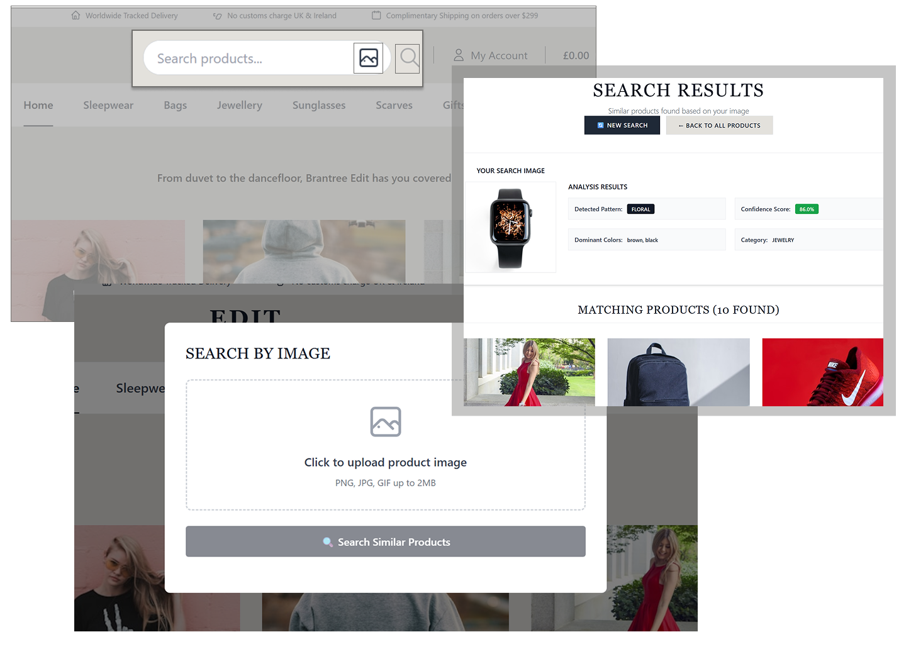

# 🤖AI-powered Fashion E‑commerce — Image Search

This project is a technical mockup demonstrating the integration of a modern Visual Search feature into an E-commerce application, built using the PHP Model-View-Controller (MVC) architectural pattern.

It was developed as a proof-of-concept to showcase strong API integration capabilities and adherence to clean, scalable architectural design in a PHP environment.

---

Table of contents📋
- [Overview](#overview)
- [Screenshots](#screenshots)
- [Key features & highlights](#key-features--highlights)
- [Technology stack](#technology-stack)
- [Architecture & data flow](architecture--data-flow)
- [Getting started (local development)](#getting-started-local-development)
  - [Prerequisites](#prerequisites)
  - [Quick start (Docker)](#quick-start-docker)
  - [Manual setup](#manual-setup)
  - [Environment variables](#environment-variables)
- [Usage](#usage)
  - [Visual search workflow](#visual-search-workflow)
  - [Example API endpoints](#example-api-endpoints)
- [License](#license)
- [Contact](#contact)
- [Appendix: Project Story & Context](#appendix:-project-story--context)
---

## Overview
--------
This project was developed as a technical demonstration for a PHP Developer position. After researching Brantree Boutique 's e-commerce platform (developed by WebsiteNI), I identified an opportunity to enhance user experience through visual search capabilities.This mockup addresses the need for a visually engaging, modern eCommerce website with improved navigation and functionality to increase online sales.

**Key Challenges Addressed:**
- Modernized traditional text-based search
- Implemented AI/ML integration in PHP environment
- Maintained clean MVC architecture while adding advanced features
- Successfully deployed to production environment

## Screenshots 
-----------------------
### Interface

*Homepage with image search functionality*

## Live Demo 
-----------------------
🚀 **Live Demo**: [https://image-search-ecommerce.onrender.com](https://image-search-ecommerce.onrender.com)

**Note**: The application is hosted on Render's free tier. It may take 20-30 seconds to load initially due to the service spinning up from an idle state.

## Key features & highlights 
-------------------------
- Image-based search: Upload an image to find visually similar products.
- Computer Vision Integration: Uses Groq's LLaMA vision model for real-time image analysis
- Category Classification: Identifies product categories (clothing, accessories, footwear)
- Confidence Scoring: Provides match accuracy percentages for transparency

## Technology stack 
----------------
Primary languages and technologies used in the repository:
- PHP (server-side application)
- JavaScript (frontend interactivity)
- CSS (styling)
- Docker (For deployment)
- Groq AI (embeddings / visual search provider)

## Architecture & data flow 
------------------------
High level:
1. Image ingestion: User uploads or drags an image into the UI.
2. Embedding generation: Image is sent to Groq AI to generate an embedding vector.
3. Index / search: The backend queries a nearest-neighbor index of product embeddings and returns ranked results.
4. UI: Results displayed with product images, price, and match score.

## Getting started (local development) 
-----------------------------------

## Prerequisites
- Git
- Docker & Docker Compose (recommended)
- PHP (>= 7.4/8.x) and Composer (if running without Docker)
- Groq AI API key (for embedding calls) or configured mock provider for local testing

## Quick start (Docker)
1. Clone the repo:
```bash
git clone https://github.com/AkshayAbraham/image-search-ecommerce.git
cd image-search-ecommerce
```

## 2. Copy example env file:
```bash
cp .env.example .env
# Edit .env and set required keys (see Environment variables)
```

## 3. Start services with Docker Compose:
```bash
docker compose up --build
```

## 4. Visit the app in your browser:
- Typically: http://localhost:8000 (check docker-compose ports)

## Manual setup
1. Install PHP dependencies:
```bash
composer install
```

2. Run the PHP built-in server (example):
```bash
php -S localhost:8000 -t public
```

## Environment variables
---------------------
Create a .env (or configure your container) with keys similar to:

- GROQ_API_KEY — API key for Groq AI embeddings (required for real embeddings)
- GROQ_API_URL — optional base URL for the embeddings API (if different)
- APP_ENV — local / development / production
- INDEX_PROVIDER — e.g. "local", "redis", "vectordb" (makes indexing pluggable)
- STORAGE_PATH — where product images are stored (local or cloud)
- PORT — port for the webserver (optional)

## Usage 
-----
## Visual search workflow 
1. From the UI click "Search by image" and upload an image.
2. Client uploads the image (or sends it as a URL) to /api/embeddings (backend).
3. Backend sends the image data (or a reference) to Groq AI and receives an embedding vector.
4. Backend searches the embedding index for nearest neighbors and returns top N matching products.
5. UI displays results sorted by similarity score.

## Example API endpoints
- POST /api/search/image — upload an image and return search results
- POST /api/embed — generate embeddings for an image (internal)
- GET /api/products — list products
- GET /api/products/:id — product detail

## License 
This project is licensed under the MIT License - see the `LICENSE` file for details. 📝

## Contact

- Author: Akshay Abraham
- GitHub: `https://github.com/AkshayAbraham`
- Email: `akshayabraham542@gmail.com`
- Linkedin: `www.linkedin.com/in/akshay-abraham`

## Appendix: Project Story & Context

*<small>*

### The Inspiration
I discovered that WebsiteNI was hiring for a Junior PHP Developer position. While I have extensive experience with JavaScript and React, my professional PHP experience was more limited. Rather than just studying PHP theoretically, I decided to build a practical project that would demonstrate my ability to quickly learn and apply PHP in a real-world context.

### The Research Process
I thoroughly explored WebsiteNI's portfolio and case studies, paying particular attention to the **Brantree Boutique** e-commerce project. Analyzing their work helped me understand their development approach, design patterns, and the types of challenges they solve for clients.

### The Implementation Strategy
Recognizing the growing importance of visual search in e-commerce, I identified an opportunity to enhance the traditional shopping experience. I designed and implemented a single, focused feature: **AI-powered visual product search**. This allowed me to demonstrate:

- **PHP MVC Architecture**: Following proper separation of concerns
- **API Integration**: Connecting with external AI services
- **Modern UX**: Creating an intuitive image-based search interface
- **Deployment Skills**: Hosting the complete application on Render

### Technical Note on AI Limitations
This implementation uses **Groq's general-purpose AI model**, which isn't specifically trained for fashion image classification. While the search functionality works technically (processing images, generating embeddings, and filtering products), the match accuracy may vary due to the model's general-purpose nature. The primary goal was to demonstrate the **integration capability and architectural approach** rather than achieving production-level accuracy.

### Learning Outcomes
- Strengthened PHP MVC pattern understanding
- Gained experience with AI/ML API integration in PHP
- Improved ability to analyze and extend existing project concepts
- Enhanced skills in containerized deployment with Docker

*This project serves as a testament to my ability to quickly adapt to new technologies and deliver functional solutions while following industry best practices.*

*</small>*

Thank you for reviewing this project — feel free to reach out for a walkthrough or live demo.


